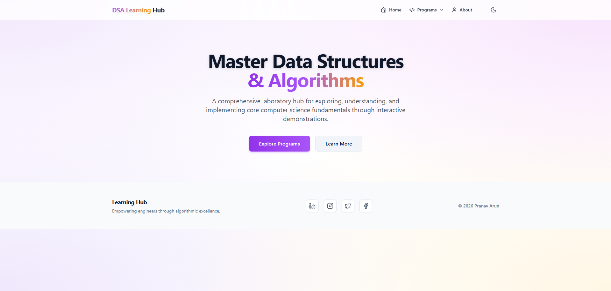
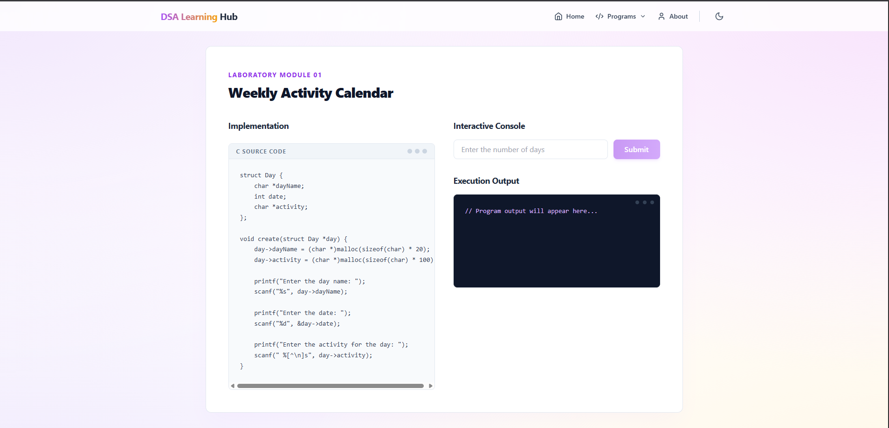
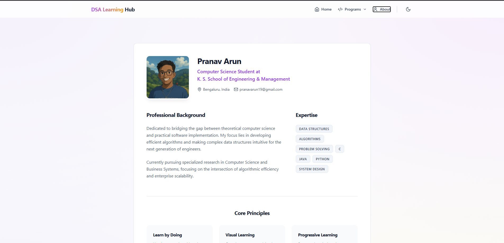
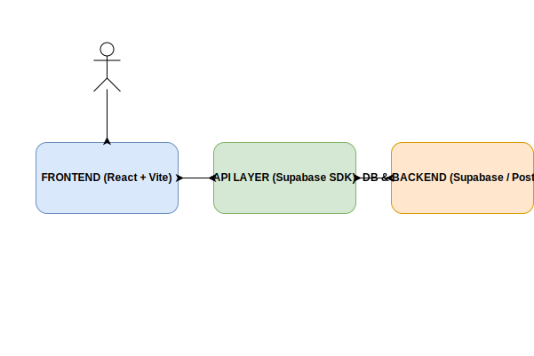

# DSA Visualizer | Data Structures & Algorithms Interactive Platform

A premium, interactive web application designed to help students visualize and understand complex Data Structures and Algorithms (DSA). Built with React, Vite, and Tailwind CSS, and integrated with Supabase for backend services.

## 🚀 Live Demo & Screenshots

### 🖥️ Homepage

The landing page features a modern, mesh-gradient design with a focus on ease of navigation and a professional aesthetic.


### 📚 Laboratory Modules

Interactive C-to-JavaScript simulations for various laboratory programs, featuring code blocks and real-time output panels.


### 👤 Profile & About

Dedicated member section highlighting professional background, expertise, and core learning principles.


### 🏗️ System Architecture

The platform follows a modern serverless architecture utilizing Supabase for Database, Auth, and Storage.


---

## ✨ Features

- **12+ Interactive Lab Programs**: Visualization for Stacks, Queues, String Matching, and more.
- **Real-time Output**: Simulated console output for algorithmic execution.
- **Dark Mode Support**: Context-aware styling using Tailwind CSS.
- **Supabase Integration**: Backend-as-a-Service for storing lab results and user data.
- **Responsive Design**: Fully optimized for mobile and desktop viewing.

---

## 🛠️ Technology Stack

- **Frontend**: [React 18](https://reactjs.org/) + [Vite](https://vitejs.dev/)
- **Styling**: [Tailwind CSS](https://tailwindcss.com/)
- **Icons**: [Lucide React](https://lucide.dev/)
- **Backend/DB**: [Supabase](https://supabase.com/) (PostgreSQL)
- **Diagrams**: [Draw.io Integration](https://marketplace.visualstudio.com/items?itemName=hediet.vscode-drawio)

---

## ⚙️ Getting Started

### Prerequisites

- Node.js (Latest LTS recommended)
- npm or yarn

### Installation

1. **Clone the repository**

   ```bash
   git clone https://github.com/toxicbishop/DSA-Original.git
   cd DSA-Original
   ```

2. **Install dependencies**

   ```bash
   npm install
   ```

3. **Configure Environment Variables**
   Create a `.env` file in the root directory and add your Supabase credentials:

   ```env
   VITE_SUPABASE_URL=your_supabase_url
   VITE_SUPABASE_ANON_KEY=your_supabase_anon_key
   ```

4. **Run the development server**
   ```bash
   npm run dev
   ```

---

## 📂 Project Structure

- `src/components`: Reusable UI components (Navigation, Hero, CodeBlock).
- `src/supabaseClient.ts`: Supabase client initialization.
- `public/assets`: Static assets and profile images.
- `system_architecture.drawio.svg`: Editable system design diagram.

---

## 🤝 Contributing

Feel free to fork this project and submit pull requests for any features or bug fixes.

## 📄 License

This project is licensed under the MIT License - see the [LICENSE](LICENSE) file for details.
